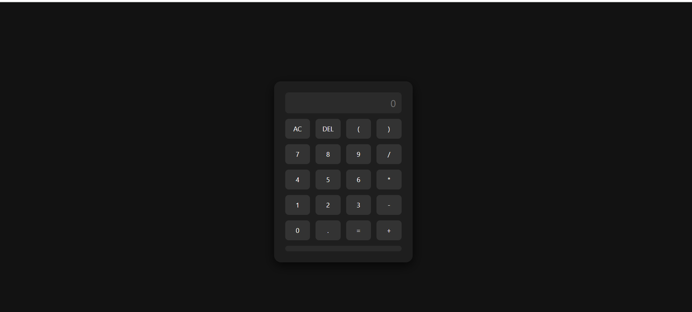

# Scientific Calculator

A modern and responsive scientific calculator built with HTML, CSS, and JavaScript. Includes history tracking, keyboard support, dark mode, and animations.

## 🔍 Features

- ✅ Basic arithmetic operations ( + , − , × , ÷ )
- 🧮 Advanced scientific functions: 
  - `sin()`, `cos()`, `tan()`
  - `sqrt()`, `log()`, `ln()`
  - `π`, `e`, parentheses, etc.
- ⌨️ Full keyboard support
- 🕶️ Dark mode toggle
- 🧠 Operation history (recent calculations)
- ✨ Smooth animations
- 📱 Fully responsive design (mobile & desktop)

## 🖥️ Demo

👉 [Live Demo](https://muhsin-eng.github.io/scientific-calculator)

## 🛠️ Built With

- HTML5  
- CSS3 (Flexbox, media queries, transitions)  
- JavaScript (DOM, keyboard events, scientific functions)  
- Git & GitHub  

## 🙋 Author

**Muhsin Frontend Dev**  
📧 daoudamouhsin@gmail.com  
🌐 [GitHub](https://github.com/Muhsin-eng)
